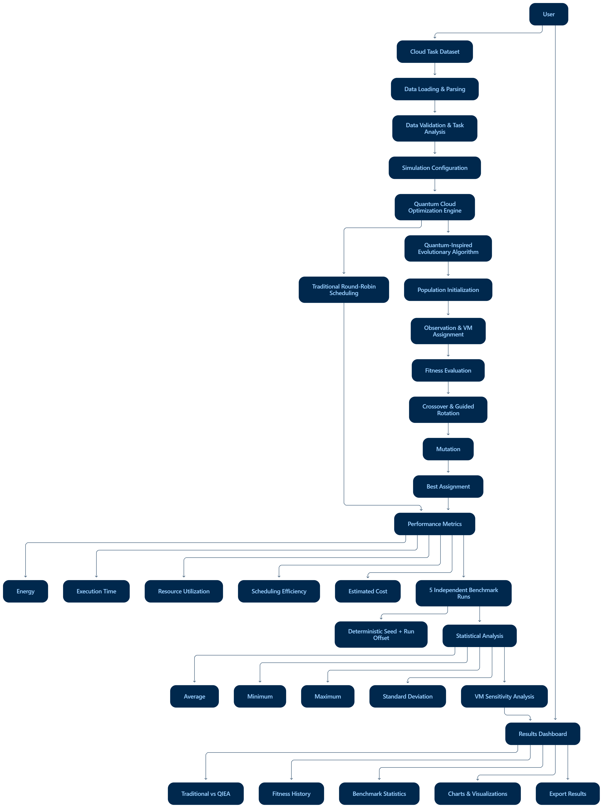
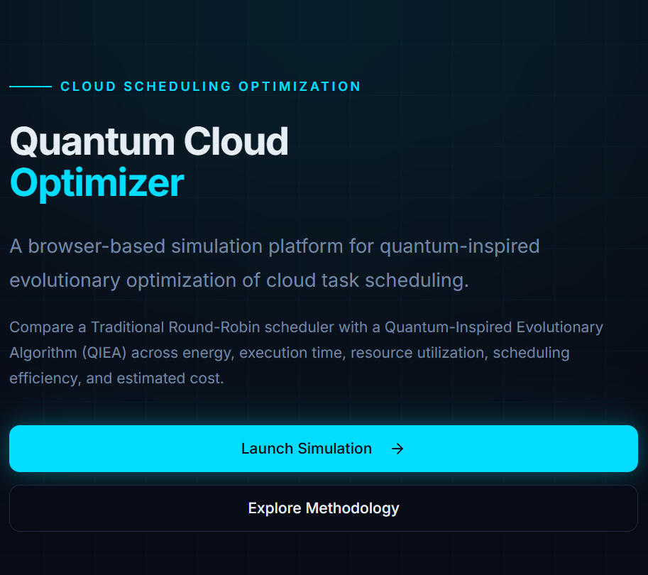
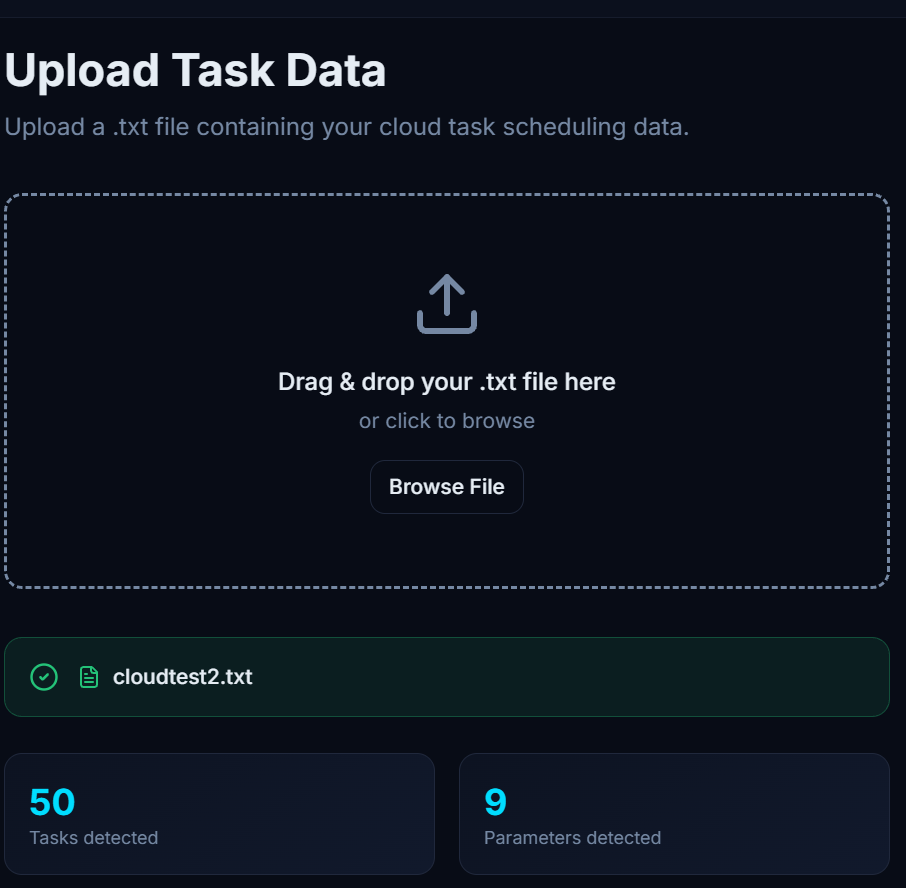
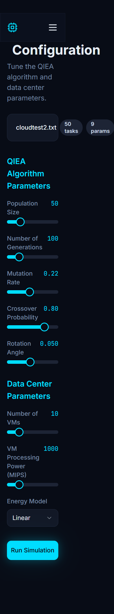
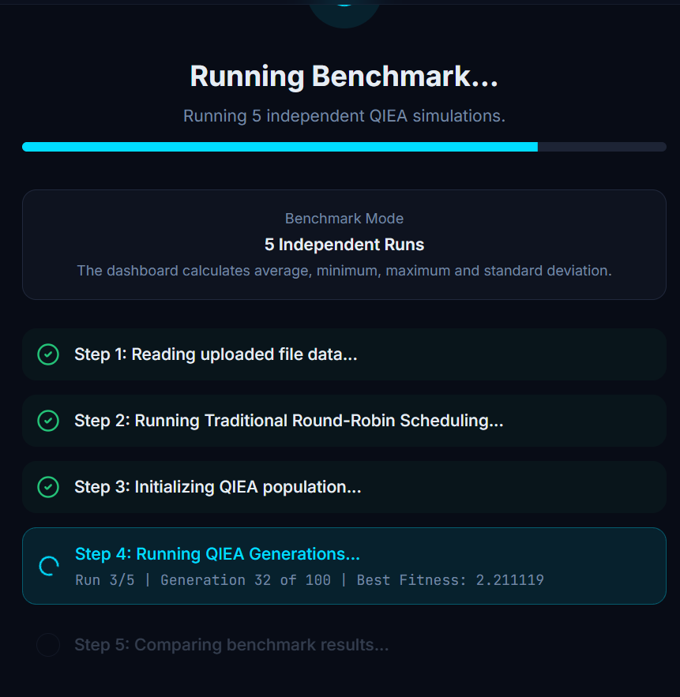
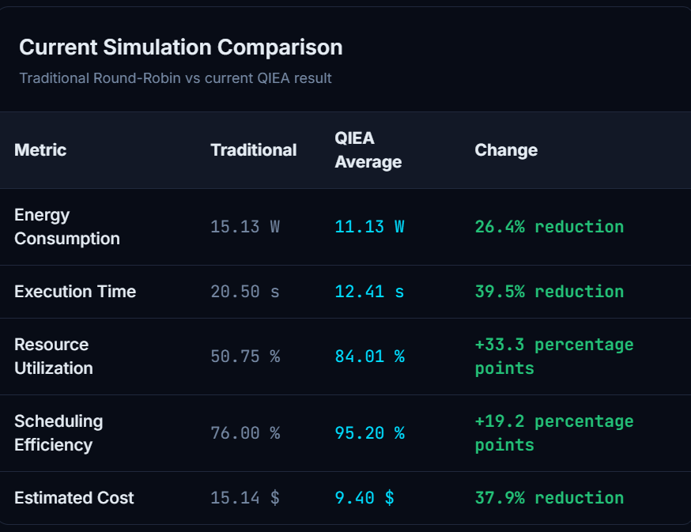
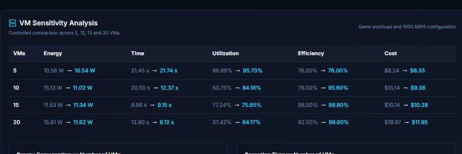

# ⚛️ Quantum Cloud Optimizer

<p align="center">
  <strong>A Quantum-Inspired Cloud Task Scheduling and Resource Optimization Dashboard</strong>
</p>

<p align="center">
  An interactive web application for analyzing cloud workloads and comparing Traditional Round-Robin scheduling with a Quantum-Inspired Evolutionary Algorithm (QIEA) through configurable simulation, reproducible benchmarking, performance metrics, and visualization.
</p>

<p align="center">
  <a href="https://github.com/NRachana015/quantum-cloud-optimizer">Repository</a>
  •
  <a href="https://github.com/NRachana015">GitHub Profile</a>
</p>

---

## 📑 Table of Contents

* [Overview](#-overview)
* [Problem Statement](#-problem-statement)
* [Motivation](#-motivation)
* [Objectives](#-objectives)
* [Core Features](#-core-features)
* [Technology Stack](#-technology-stack)
* [System Architecture](#-system-architecture)
* [Architecture Explanation](#-architecture-explanation)
* [Dataset](#-dataset)
* [Dataset Schema](#-dataset-schema)
* [Data Processing](#-data-processing)
* [Simulation and Optimization Logic](#-simulation-and-optimization-logic)
* [Traditional Scheduling](#-traditional-scheduling)
* [Quantum-Inspired Evolutionary Algorithm](#-quantum-inspired-evolutionary-algorithm)
* [Scheduling Factors](#-scheduling-factors)
* [Optimization Objectives](#-optimization-objectives)
* [Performance Metrics](#-performance-metrics)
* [Reproducible Benchmarking](#-reproducible-benchmarking)
* [VM Sensitivity Analysis](#-vm-sensitivity-analysis)
* [System Workflow](#-system-workflow)
* [Application Modules](#-application-modules)
* [Results and Visualization](#-results-and-visualization)
* [Project Structure](#-project-structure)
* [Getting Started](#-getting-started)
* [Prerequisites](#-prerequisites)
* [Installation](#-installation)
* [Running the Development Server](#-running-the-development-server)
* [Production Build](#-production-build)
* [Preview](#-preview)
* [Testing](#-testing)
* [Linting](#-linting)
* [How the Application Works](#-how-the-application-works)
* [Key Capabilities](#-key-capabilities)
* [Project Goals](#-project-goals)
* [Future Enhancements](#-future-enhancements)
* [Important Technical Notes](#-important-technical-notes)
* [Limitations](#-limitations)
* [Disclaimer](#-disclaimer)
* [Author and Connect](#-author-and-connect)
* [License](#-license)

---

## 🔭 Overview

**Quantum Cloud Optimizer** is a browser-based cloud task scheduling and resource optimization application developed using **React, TypeScript, and Vite**.

The system provides an interactive environment for loading cloud workload datasets, configuring simulation parameters, executing scheduling simulations, comparing a traditional scheduling baseline with a Quantum-Inspired Evolutionary Algorithm (QIEA), and analyzing the resulting performance metrics.

The application focuses on optimization-oriented cloud scheduling rather than physical cloud orchestration.

The system combines:

* Cloud task scheduling
* Workload analysis
* Virtual machine allocation
* Quantum-inspired evolutionary optimization
* Traditional Round-Robin scheduling
* Energy-aware simulation
* Execution-time analysis
* Resource utilization analysis
* Scheduling efficiency analysis
* Estimated cost analysis
* Reproducible benchmarking
* Statistical performance analysis
* VM sensitivity analysis
* Interactive data visualization

> **Important:** QIEA is implemented as a **classical quantum-inspired computational simulation running in the browser**. The current application does not execute the algorithm on physical quantum hardware.

---

## 🎯 Problem Statement

Cloud computing environments execute heterogeneous workloads across multiple virtual machines.

Different tasks may have different:

* Workload sizes
* Priorities
* Deadlines
* CPU requirements
* Memory requirements
* Bandwidth requirements
* Execution characteristics

A scheduling strategy that does not account for workload distribution and resource utilization can lead to inefficient VM allocation, increased execution time, higher energy consumption, and poor resource utilization.

The **Quantum Cloud Optimizer** explores this scheduling problem by modeling task allocation as an optimization problem and comparing a traditional scheduling approach with a quantum-inspired evolutionary approach.

The project aims to provide an interactive experimental environment for studying how optimization-based scheduling can affect cloud workload performance.

---

## 💡 Motivation

Cloud scheduling is a multi-objective optimization problem because several performance characteristics may need to be considered simultaneously.

A scheduler may need to balance:

* Energy consumption
* Execution time
* Resource utilization
* Scheduling efficiency
* Estimated computational cost

Traditional scheduling strategies such as Round-Robin provide simple workload distribution but do not explicitly optimize these objectives together.

This project explores a **Quantum-Inspired Evolutionary Algorithm (QIEA)** as an optimization-oriented approach for generating and improving VM assignments.

The goal is not to claim quantum computational advantage, but to demonstrate how quantum-inspired representations and evolutionary optimization concepts can be applied to cloud scheduling simulations.

---

## 🎯 Objectives

The major objectives of the project are:

1. Analyze structured cloud workload datasets.
2. Model cloud task-to-VM scheduling as an optimization problem.
3. Implement a Traditional Round-Robin scheduling baseline.
4. Implement a Quantum-Inspired Evolutionary Algorithm.
5. Evaluate scheduling performance using multiple metrics.
6. Support configurable VM and optimization parameters.
7. Provide deterministic and reproducible simulation results.
8. Perform multiple independent benchmark runs.
9. Calculate statistical benchmark measures.
10. Analyze the effect of VM count on scheduling performance.
11. Present results through an interactive dashboard.
12. Provide a visual and understandable environment for studying cloud optimization.

---

## ✨ Core Features

The application provides an optimization-focused cloud scheduling dashboard with the following capabilities:

### 📂 Dataset Processing

* Upload structured workload datasets.
* Automatically parse workload records.
* Detect relevant task and workload columns.
* Validate dataset structure.
* Analyze workload characteristics.

### ⚙️ Configurable Simulation

Users can configure:

* Population size
* Number of generations
* Mutation rate
* Crossover probability
* Rotation angle
* Number of virtual machines
* VM processing capacity
* Energy model
* Random seed

### 🔄 Scheduling Comparison

The system compares:

* Traditional Round-Robin scheduling
* Quantum-Inspired Evolutionary Algorithm scheduling

### ⚛️ QIEA Optimization

The optimizer uses:

* Quantum-inspired state representation
* Observation and VM assignment
* Fitness evaluation
* Crossover
* Guided rotation
* Mutation
* Best assignment tracking
* Fitness history

### 📊 Performance Metrics

The dashboard evaluates:

* Energy consumption
* Execution time
* Resource utilization
* Scheduling efficiency
* Estimated cost

### 🔬 Reproducible Benchmarking

The system performs:

* 5 independent benchmark runs
* Deterministic random seeds
* Run-specific seed offsets
* Average calculation
* Minimum calculation
* Maximum calculation
* Standard deviation calculation

### 🖥️ VM Sensitivity Analysis

The application evaluates different VM configurations to study how VM availability affects scheduling performance.

The current analysis evaluates multiple VM counts using the same workload and configured VM processing capacity.

### 📈 Interactive Results Dashboard

The results interface provides:

* Metric comparison
* Charts
* Fitness history
* Benchmark statistics
* VM sensitivity analysis
* Scheduling tables
* Export functionality

---

## 🛠️ Technology Stack

| Category             | Technology                     |
| -------------------- | ------------------------------ |
| Frontend             | React                          |
| Programming Language | TypeScript                     |
| Build Tool           | Vite                           |
| Styling              | CSS / Tailwind-based styling   |
| Package Manager      | npm                            |
| Dataset              | CSV / structured workload data |
| Testing              | Vitest                         |
| Linting              | ESLint                         |
| Development Server   | Vite                           |
| Runtime              | Modern Web Browser             |

The application is implemented as a client-side web application. The scheduling and optimization simulation is executed in the browser.

---

## 🏗️ System Architecture



The system follows a complete workflow from workload input and preprocessing through optimization, benchmarking, statistical analysis, and visualization.

The major processing stages are:

```text
Cloud Task Dataset
        │
        ▼
Data Loading & Parsing
        │
        ▼
Data Validation & Task Analysis
        │
        ▼
Simulation Configuration
        │
        ▼
Quantum Cloud Optimization Engine
        │
        ├───────────────┐
        ▼               ▼
Traditional        Quantum-Inspired
Round-Robin        Evolutionary Algorithm
        │               │
        └───────┬───────┘
                ▼
       Performance Metrics
                │
                ▼
       5 Independent Runs
                │
                ▼
       Statistical Analysis
                │
                ▼
       VM Sensitivity Analysis
                │
                ▼
        Results Dashboard
```

> **Architecture Note:** The QIEA component is a classical software simulation inspired by quantum computing concepts. No physical quantum processor is required.

---

## 🧩 Architecture Explanation

### 1. Workload Dataset

The system accepts structured cloud workload data containing task-level characteristics.

The dataset is processed into an internal representation that can be used by the scheduling engine.

### 2. Data Loading and Parsing

The dataset parser:

* Reads uploaded workload data.
* Detects the delimiter.
* Extracts headers.
* Converts numeric values.
* Organizes task records.
* Validates the dataset.

### 3. Data Validation and Analysis

The application validates the workload and identifies relevant columns such as:

* Task identifier
* Workload length
* Deadline
* Other workload characteristics

The resulting task representation becomes the input to the scheduling simulator.

### 4. Simulation Configuration

Users can configure the optimization environment through the Configuration page.

Parameters include:

* Population size
* Generations
* Mutation rate
* Crossover probability
* Rotation angle
* Number of VMs
* VM MIPS
* Energy model
* Random seed

### 5. Scheduling Engine

The scheduling engine executes both:

* Traditional Round-Robin scheduling
* Quantum-Inspired Evolutionary Algorithm scheduling

### 6. Performance Evaluation

Both approaches are evaluated using common performance metrics.

### 7. Benchmarking

Multiple independent runs are performed using deterministic seed offsets.

### 8. Statistical Analysis

Benchmark results are summarized using:

* Average
* Minimum
* Maximum
* Standard deviation

### 9. VM Sensitivity Analysis

The simulator evaluates scheduling behavior under different VM counts.

### 10. Results Dashboard

The final results are presented using cards, tables, charts, fitness history, benchmark statistics, and VM sensitivity visualizations.

---

# 📊 Dataset

The application is designed to work with structured cloud workload datasets.

A workload record can contain task-level scheduling and resource characteristics such as:

* Task ID
* Task length
* Priority
* Deadline
* CPU requirement
* Memory requirement
* Bandwidth requirement
* VM information
* Execution characteristics

The application also supports uploaded datasets through its dataset upload workflow.

The exact dataset structure used for a particular experiment is displayed and validated by the application before simulation.

---

# 🧾 Dataset Schema

A typical workload schema can contain the following fields:

| Field            | Description                                |
| ---------------- | ------------------------------------------ |
| `task_id`        | Unique identifier of the cloud task        |
| `length`         | Workload/task length                       |
| `priority`       | Task priority                              |
| `deadline`       | Scheduling deadline                        |
| `cpu_req`        | CPU requirement                            |
| `memory_req`     | Memory requirement                         |
| `bandwidth`      | Bandwidth requirement                      |
| `vm_id`          | VM associated with the task when available |
| `execution_time` | Task execution characteristic              |

The simulator primarily uses the workload information required for task scheduling and VM allocation.

---

# 🔄 Data Processing

The general processing pipeline consists of:

1. Loading the workload dataset.
2. Detecting the dataset structure.
3. Parsing task records.
4. Converting numerical fields.
5. Validating the workload.
6. Identifying scheduling-related attributes.
7. Preparing task representations.
8. Passing the workload to the simulation engine.
9. Generating performance metrics.
10. Presenting the results through the dashboard.

This allows the same simulation framework to work with structured workload inputs rather than relying on a single hard-coded experiment.

---

# ⚙️ Simulation and Optimization Logic

The project models cloud task scheduling as a multi-objective optimization problem.

The simulator evaluates VM assignments based on several characteristics.

The major optimization dimensions are:

```text
Cloud Workload
      │
      ├── Task Workload
      ├── VM Assignment
      ├── VM Capacity
      └── Scheduling Configuration
              │
              ▼
       Scheduling Simulation
              │
              ├── Energy
              ├── Execution Time
              ├── Utilization
              ├── Efficiency
              └── Cost
              │
              ▼
        Fitness Evaluation
              │
              ▼
        QIEA Optimization
              │
              ▼
       Best VM Assignment
```

The QIEA optimizer searches for improved VM assignments while the Traditional Round-Robin scheduler provides a baseline for comparison.

---

# 🔁 Traditional Scheduling

The project uses **Round-Robin scheduling** as the traditional baseline.

In the baseline approach, tasks are distributed across available VMs in a sequential cyclic manner.

For example:

```text
Task 1 → VM 1
Task 2 → VM 2
Task 3 → VM 3
...
Task N → next VM
```

The Round-Robin implementation provides a simple reference scheduling strategy against which the QIEA results can be compared.

The baseline is evaluated using the same performance metrics as the QIEA solution.

---

# ⚛️ Quantum-Inspired Evolutionary Algorithm

The optimization component uses a **Quantum-Inspired Evolutionary Algorithm (QIEA)** implemented entirely as a classical simulation.

The algorithm uses quantum-inspired probability-state representations to guide the evolutionary search.

## 1. Population Initialization

A population of candidate solutions is initialized.

Each candidate represents a possible VM assignment for the workload.

Quantum-inspired states are represented using angle-based values corresponding to probability amplitudes.

Conceptually:

```text
Quantum-Inspired State
        │
        ▼
   [ α , β ]
        │
        ▼
Probability Representation
        │
        ▼
    VM Assignment
```

## 2. Observation

The quantum-inspired state is observed to generate a concrete VM assignment for each task.

The observation process converts the probabilistic representation into a classical scheduling solution.

## 3. Fitness Evaluation

Each candidate scheduling solution is evaluated according to the optimization objectives.

The evaluation calculates:

* Energy
* Execution time
* Resource utilization
* Scheduling efficiency
* Estimated cost

The resulting objective value is converted into a fitness value.

## 4. Crossover

Candidate solutions undergo crossover operations to introduce new combinations of scheduling information.

The implementation applies crossover between neighboring individuals according to the configured crossover probability.

## 5. Guided Rotation

The quantum-inspired states are updated using a guided rotation mechanism toward the current best assignment.

This allows the population to progressively move toward better scheduling solutions.

## 6. Mutation

Mutation introduces controlled variation into candidate states.

The mutation rate is configurable through the simulation interface.

## 7. Best Assignment

After the configured number of generations, the best observed scheduling assignment is selected as the QIEA result.

## 8. Fitness History

The best fitness value from each generation is recorded.

This history is displayed on the Results page to visualize optimization progress.

---

# 📅 Scheduling Factors

Cloud scheduling can involve several competing factors.

| Scheduling Factor  | Role                                       |
| ------------------ | ------------------------------------------ |
| Task Workload      | Represents the computational workload      |
| Task Priority      | Represents task importance                 |
| Deadline           | Represents timing constraints              |
| CPU Requirement    | Represents processing demand               |
| Memory Requirement | Represents memory demand                   |
| Bandwidth          | Represents communication demand            |
| VM Assignment      | Represents task-resource allocation        |
| VM Capacity        | Represents available processing capability |
| Execution Time     | Represents workload execution behavior     |

The simulator focuses primarily on the workload and resource information required by the implemented scheduling model.

---

# 🎯 Optimization Objectives

The QIEA fitness function is designed around multiple scheduling objectives.

The implemented objective combines:

* Energy consumption
* Execution time
* Resource utilization
* Scheduling efficiency

The optimization uses weighted objective components.

Conceptually:

```text
Overall Objective
       │
       ├── Energy Component
       │
       ├── Execution Time Component
       │
       ├── Utilization Component
       │
       └── Efficiency Component
```

The current implementation uses:

| Objective Component   | Weight |
| --------------------- | -----: |
| Energy                |    30% |
| Execution Time        |    30% |
| Utilization           |    20% |
| Scheduling Efficiency |    20% |

The resulting objective value is converted into a fitness score used by the evolutionary optimization process.

---

# 📏 Performance Metrics

The application evaluates scheduling solutions using five primary metrics.

## ⚡ Energy Consumption

Represents the estimated energy associated with the scheduling configuration.

The simulator supports:

* Linear energy model
* Square energy model
* Cubic energy model

## ⏱️ Execution Time

Represents the simulated scheduling makespan/execution time associated with the workload assignment.

## 📊 Resource Utilization

Measures how effectively the available VM processing capacity is utilized.

Higher utilization indicates greater use of the configured processing capacity, although utilization is evaluated together with the other objectives.

## ✅ Scheduling Efficiency

Represents the efficiency of the generated scheduling solution relative to the simulation's workload and resource characteristics.

## 💰 Estimated Cost

Provides an estimated computational cost derived from the simulation metrics.

The cost is an analytical simulation metric rather than a real cloud-provider billing amount.

---

# 🔬 Reproducible Benchmarking

Reproducibility is an important part of the project.

The simulation supports a configurable **random seed**.

The default base seed is:

```text
12345
```

The benchmark performs **five independent runs**.

Each run uses a deterministic seed offset:

| Run   |          Seed |
| ----- | ------------: |
| Run 1 | Base seed + 0 |
| Run 2 | Base seed + 1 |
| Run 3 | Base seed + 2 |
| Run 4 | Base seed + 3 |
| Run 5 | Base seed + 4 |

For the default seed:

```text
Run 1 → 12345
Run 2 → 12346
Run 3 → 12347
Run 4 → 12348
Run 5 → 12349
```

The Simulation page displays the benchmark seed schedule so that each run can be tracked.

### Statistical Analysis

After the benchmark runs, the application calculates:

* Average
* Minimum
* Maximum
* Standard deviation

This provides a more informative view of performance than relying on a single stochastic run.

---

# 🖥️ VM Sensitivity Analysis

The application includes a VM sensitivity analysis to study how scheduling behavior changes with different numbers of virtual machines.

The current analysis evaluates multiple VM configurations while keeping the workload and VM processing capacity consistent.

Example VM configurations include:

```text
5 VMs
10 VMs
15 VMs
20 VMs
```

For each configuration, the simulator calculates performance metrics such as:

* Energy
* Execution time
* Resource utilization
* Scheduling efficiency
* Estimated cost

The results are presented through a dedicated sensitivity analysis section on the Results page.

This allows users to examine how the number of available VMs influences scheduling behavior.

---

# 🔁 System Workflow

The complete application workflow is:

```text
┌──────────────────────────────┐
│       Cloud Task Dataset     │
└──────────────┬───────────────┘
               │
               ▼
┌──────────────────────────────┐
│      Dataset Upload / Load   │
└──────────────┬───────────────┘
               │
               ▼
┌──────────────────────────────┐
│    Parsing & Validation      │
└──────────────┬───────────────┘
               │
               ▼
┌──────────────────────────────┐
│     Simulation Configuration │
└──────────────┬───────────────┘
               │
               ▼
       ┌───────┴────────┐
       │                │
       ▼                ▼
┌───────────────┐ ┌──────────────────┐
│ Round-Robin   │ │ QIEA Optimization│
│   Baseline    │ │                  │
└───────┬───────┘ └────────┬─────────┘
        │                  │
        └─────────┬────────┘
                  ▼
       ┌─────────────────────┐
       │ Performance Metrics │
       └──────────┬──────────┘
                  │
                  ▼
       ┌─────────────────────┐
       │ 5 Benchmark Runs    │
       └──────────┬──────────┘
                  │
                  ▼
       ┌─────────────────────┐
       │ Statistical Analysis│
       └──────────┬──────────┘
                  │
                  ▼
       ┌─────────────────────┐
       │ VM Sensitivity      │
       │ Analysis            │
       └──────────┬──────────┘
                  │
                  ▼
       ┌─────────────────────┐
       │ Results Dashboard   │
       └─────────────────────┘
```

### Workflow Steps

**1. Load Dataset**

The user uploads a structured cloud workload dataset.

**2. Parse Dataset**

The application detects and processes the dataset structure.

**3. Validate Workload**

The application validates the workload before allowing simulation.

**4. Configure Simulation**

The user configures the VM and optimization parameters.

**5. Run Simulation**

Traditional Round-Robin and QIEA scheduling are executed.

**6. Calculate Metrics**

The scheduling solutions are evaluated using the implemented performance metrics.

**7. Benchmark**

Five independent seeded runs are performed.

**8. Analyze Statistics**

Average, minimum, maximum, and standard deviation are calculated.

**9. Analyze VM Sensitivity**

The workload is evaluated under different VM configurations.

**10. Visualize Results**

The final results are displayed through interactive charts, tables, and metric cards.

---

# 🖥️ Application Modules

The application is organized into several functional modules.

## 🏠 Home

Provides the project introduction and entry point into the scheduling workflow.

## 📂 Upload Dataset

Allows users to load a structured workload dataset.

The uploaded dataset is parsed and validated before simulation.

## ⚙️ Configuration

Provides configurable simulation parameters including:

* Population size
* Generations
* Mutation rate
* Crossover probability
* Rotation angle
* Number of VMs
* VM MIPS
* Energy model
* Random seed

## 🔬 Simulation

Executes the scheduling algorithms and benchmark runs.

The Simulation page also displays the benchmark seed schedule and run progress.

## 📊 Results

Provides the main performance analysis dashboard.

The Results page includes:

* Traditional vs QIEA metrics
* Performance comparison
* Fitness history
* Benchmark statistics
* VM sensitivity analysis
* Scheduling results
* Export functionality

## ℹ️ About

Provides information about the project and its implementation concept.

---

# 📈 Results and Visualization

The Results dashboard provides multiple visualizations for interpreting the simulation.

### Performance Comparison

Compares Traditional Round-Robin and QIEA across the implemented performance metrics.

### Fitness History

Displays the fitness progression across generations of the QIEA optimization process.

This helps visualize how the evolutionary search changes over time.

### Benchmark Statistics

Summarizes the five independent runs using:

* Average
* Minimum
* Maximum
* Standard deviation

### VM Sensitivity

Displays how scheduling performance changes with different VM counts.

### Metric Cards

Important results are summarized through dashboard metric cards for quick interpretation.

### Scheduling Tables

The dashboard provides tabular information for examining scheduling results and VM allocation behavior.

### Export

The application provides an export option for preserving simulation results.

---

# 🖼️ Application Screenshots

## Home



## Dataset Upload



## Configuration



## Simulation



## Results Dashboard



## VM Sensitivity Analysis



---

# 📁 Project Structure

The project follows a modern React + TypeScript + Vite structure.

```text
quantum-cloud-optimizer/
│
├── docs/
│   ├── architecture/
│   │   └── system-architecture.png
│   │
│   └── screenshots/
│       ├── 01-home-top.png
│       ├── 02-upload.png
│       ├── 03-configuration.png
│       ├── 04-simulation.png
│       ├── 05-results.png
│       └── 06-vm-sensitivity.png
│
├── public/
│
├── src/
│   ├── components/
│   ├── pages/
│   ├── ...
│   └── ...
│
├── package.json
├── package-lock.json
├── vite.config.*
├── tsconfig.*
├── eslint.config.*
└── README.md
```

### Important Project Areas

| File / Directory     | Purpose                           |
| -------------------- | --------------------------------- |
| `src/`               | Main application source           |
| `src/components/`    | Reusable interface components     |
| `src/pages/`         | Application workflow pages        |
| `docs/architecture/` | System architecture documentation |
| `docs/screenshots/`  | Application screenshots           |
| `package.json`       | Dependencies and npm scripts      |
| `README.md`          | Project documentation             |

The exact source tree may contain additional implementation-specific files.

---

# 🚀 Getting Started

Follow the steps below to run the Quantum Cloud Optimizer locally.

---

# 📋 Prerequisites

Make sure the following are installed:

* Node.js
* npm
* Git

Verify Node.js:

```bash
node --version
```

Verify npm:

```bash
npm --version
```

Verify Git:

```bash
git --version
```

---

# 📥 Installation

Clone the repository:

```bash
git clone https://github.com/NRachana015/quantum-cloud-optimizer.git
```

Move into the project directory:

```bash
cd quantum-cloud-optimizer
```

Install dependencies:

```bash
npm install
```

---

# ▶️ Running the Development Server

Start the Vite development server:

```bash
npm run dev
```

The development server is configured to run on:

```text
http://localhost:8080/
```

Open the displayed local URL in your browser.

---

# 🏭 Production Build

Create a production build using:

```bash
npm run build
```

The production output is generated in the Vite build directory.

---

# 👀 Preview

To preview the production build locally:

```bash
npm run preview
```

---

# 🧪 Testing

The project includes automated tests using **Vitest**.

Run the complete test suite:

```bash
npm test
```

The current test suite verifies important parts of the application including:

* Dataset parsing
* Dataset validation
* Simulation execution
* Fitness history generation
* Improvement metrics
* VM configuration
* Energy model support
* Seed reproducibility

Current verified test status:

```text
Test Files: 1 passed
Tests:      9 passed
```

The reproducibility test verifies that the same workload and simulation configuration with the same random seed produce reproducible results.

---

# 🔍 Linting

Run ESLint using:

```bash
npm run lint
```

The project is maintained with linting checks to identify code-quality and consistency issues.

---

# 🏗️ Production Build Verification

The project can also be verified by generating the production build:

```bash
npm run build
```

The current implementation successfully completes the production build.

The build may report non-blocking warnings related to:

* Browser compatibility data being outdated
* Large JavaScript chunks after minification

These warnings do not prevent the application from building successfully.

---

# 🔄 How the Application Works

The complete application process can be summarized as:

```text
                 ┌─────────────────────────┐
                 │     Cloud Workload      │
                 │        Dataset          │
                 └────────────┬────────────┘
                              │
                              ▼
                 ┌─────────────────────────┐
                 │    Dataset Parsing      │
                 │     & Validation        │
                 └────────────┬────────────┘
                              │
                              ▼
                 ┌─────────────────────────┐
                 │ Simulation Configuration│
                 └────────────┬────────────┘
                              │
                    ┌─────────┴─────────┐
                    │                   │
                    ▼                   ▼
          ┌─────────────────┐   ┌──────────────────┐
          │ Traditional     │   │ Quantum-Inspired│
          │ Round-Robin     │   │ Evolutionary    │
          │                 │   │ Algorithm        │
          └────────┬────────┘   └─────────┬────────┘
                   │                      │
                   └──────────┬───────────┘
                              ▼
                 ┌─────────────────────────┐
                 │  Performance Metrics    │
                 └────────────┬────────────┘
                              │
                              ▼
                 ┌─────────────────────────┐
                 │ 5 Independent Benchmark │
                 │          Runs           │
                 └────────────┬────────────┘
                              │
                              ▼
                 ┌─────────────────────────┐
                 │ Statistical Evaluation  │
                 └────────────┬────────────┘
                              │
                              ▼
                 ┌─────────────────────────┐
                 │ VM Sensitivity Analysis │
                 └────────────┬────────────┘
                              │
                              ▼
                 ┌─────────────────────────┐
                 │    Results Dashboard    │
                 └─────────────────────────┘
```

### Step 1 — Workload Input

A structured workload dataset is loaded into the application.

### Step 2 — Data Processing

The dataset is parsed and validated.

### Step 3 — Configuration

The user selects simulation parameters.

### Step 4 — Traditional Scheduling

The Round-Robin baseline generates a reference scheduling solution.

### Step 5 — QIEA Optimization

The Quantum-Inspired Evolutionary Algorithm searches for an improved VM assignment.

### Step 6 — Performance Evaluation

Both approaches are evaluated using common performance metrics.

### Step 7 — Benchmarking

The QIEA simulation is repeated using deterministic seed offsets.

### Step 8 — Statistical Analysis

Benchmark results are summarized statistically.

### Step 9 — VM Sensitivity

Different VM configurations are evaluated.

### Step 10 — Dashboard

The results are presented through charts, tables, and performance cards.

---

# 🌟 Key Capabilities

The Quantum Cloud Optimizer demonstrates:

* Structured cloud workload processing
* Dataset validation
* Configurable cloud scheduling simulation
* Traditional Round-Robin scheduling
* Quantum-Inspired Evolutionary Algorithm
* Quantum-inspired state representation
* Crossover
* Guided rotation
* Mutation
* Multi-objective fitness evaluation
* Energy-aware scheduling analysis
* Execution-time analysis
* Resource utilization analysis
* Scheduling efficiency analysis
* Estimated cost analysis
* Five-run reproducible benchmarking
* Deterministic random seeds
* Statistical performance analysis
* VM sensitivity analysis
* Fitness-history visualization
* Interactive results dashboard
* Scheduling comparison
* Result export
* Automated testing
* Production build verification

---

# 🎓 Project Goals

The major goals of the project are:

1. Understand cloud task scheduling problems.
2. Represent cloud workloads using structured data.
3. Model task-to-VM allocation as an optimization problem.
4. Implement a traditional scheduling baseline.
5. Explore quantum-inspired evolutionary optimization.
6. Evaluate multiple scheduling objectives.
7. Provide reproducible simulation experiments.
8. Analyze the effect of VM count.
9. Visualize optimization behavior.
10. Build a modern interactive cloud optimization dashboard.
11. Provide an experimental environment for studying optimization-based scheduling.

---

# 🔮 Future Enhancements

The current project can be extended in several directions.

## Advanced Scheduling Algorithms

Additional scheduling strategies could be implemented and compared, such as:

* Genetic Algorithms
* Particle Swarm Optimization
* Ant Colony Optimization
* Reinforcement Learning-based scheduling

## Advanced Quantum-Inspired Optimization

Future research could explore:

* Improved quantum-inspired operators
* Hybrid quantum-classical optimization
* QAOA-based formulations
* Quantum annealing approaches

These are future research directions and are not part of the current implementation unless explicitly added.

## Larger Workloads

The simulator could be evaluated using:

* Larger datasets
* Real-world cloud traces
* More heterogeneous workloads
* Dynamic workload streams

## Advanced Resource Modeling

Future versions could include more detailed:

* CPU utilization models
* Memory utilization
* Network bandwidth modeling
* VM power states
* Dynamic resource availability

## Real Cloud Integration

The system could eventually connect scheduling decisions with real cloud infrastructure or cloud simulation frameworks.

## Real-Time Monitoring

Future versions could provide real-time workload and resource monitoring.

## Quantum Hardware Integration

Suitable optimization formulations could potentially be explored using quantum computing platforms in future research.

---

# 📝 Important Technical Notes

* The project is implemented as a client-side React/TypeScript web application.
* Vite is used as the development and production build tool.
* The QIEA is a **classical quantum-inspired simulation**.
* No physical quantum processor is required.
* The simulator uses configurable random seeds for reproducibility.
* Five independent benchmark runs are used for benchmark analysis.
* Each benchmark run uses a deterministic seed offset from the configured base seed.
* The Traditional Round-Robin algorithm acts as the baseline scheduling method.
* The QIEA and baseline are evaluated using the same workload and performance metrics.
* Energy models currently include Linear, Square, and Cubic models.
* Estimated cost is a simulation metric and does not represent actual cloud-provider billing.
* VM sensitivity analysis uses simulator-generated results for different VM counts.
* Results are generated dynamically from the simulation rather than being presented as hard-coded benchmark values.

---

# ⚠️ Limitations

The current project has several limitations.

### Classical Simulation

The QIEA is quantum-inspired but executes entirely on classical computing resources.

### Simplified Cloud Model

The simulator models cloud scheduling mathematically rather than interacting with physical cloud infrastructure.

### Estimated Energy

Energy values are generated using the implemented simulation models and should not be interpreted as measurements from physical hardware.

### Estimated Cost

The cost metric is a simulation-based estimate rather than an actual AWS, Azure, or Google Cloud billing calculation.

### Browser Execution

The optimization algorithm executes within the browser, which limits scalability for extremely large workloads.

### Simplified VM Model

The current VM representation uses configured processing capacity rather than a complete cloud infrastructure model.

These limitations define the scope of the current experimental implementation.

---

# ⚠️ Disclaimer

**Quantum Cloud Optimizer** is an educational and experimental software project developed to explore cloud task scheduling, resource optimization, quantum-inspired evolutionary algorithms, reproducible benchmarking, and data visualization.

The project should not be interpreted as a production cloud orchestration platform or as a measurement of real-world cloud infrastructure performance.

The term **quantum-inspired** refers to the computational concepts used by the optimization algorithm. It does not imply that the application runs on physical quantum hardware.

All performance metrics generated by the simulator should be interpreted within the assumptions and mathematical models implemented in the application.

---

# 👩‍💻 Author and Connect

**Rachana Nyavanandhi**

GitHub:

https://github.com/NRachana015

Project Repository:

https://github.com/NRachana015/quantum-cloud-optimizer

---

<p align="center">
  <strong>⚛️ Quantum Cloud Optimizer</strong>
  <br>
  Quantum-Inspired Scheduling • Cloud Optimization • Benchmarking • Visualization
  <br><br>
  Built with React • TypeScript • Vite
</p>

---

# 📄 License

This project is intended for educational, academic, and research-oriented use.

Add an appropriate open-source license file to the repository if you intend to distribute the project under a specific license.
